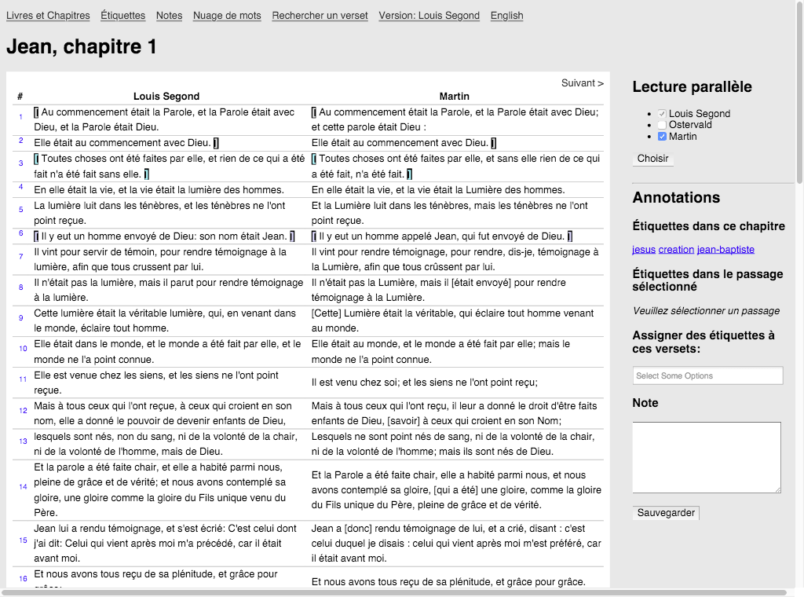
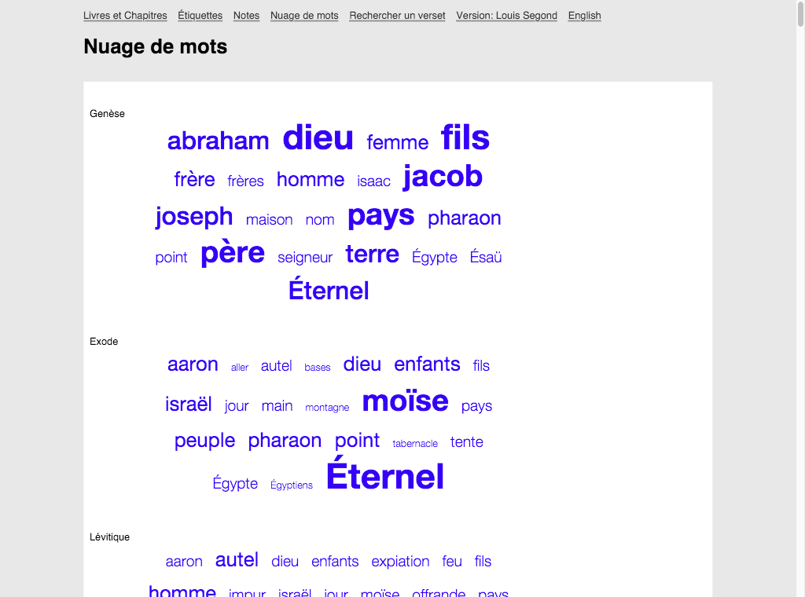
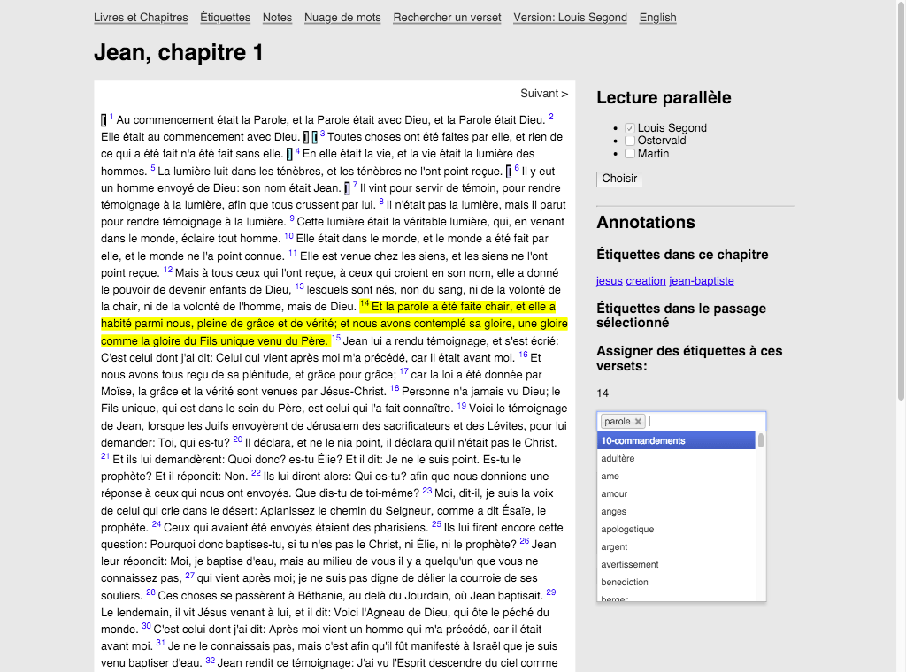
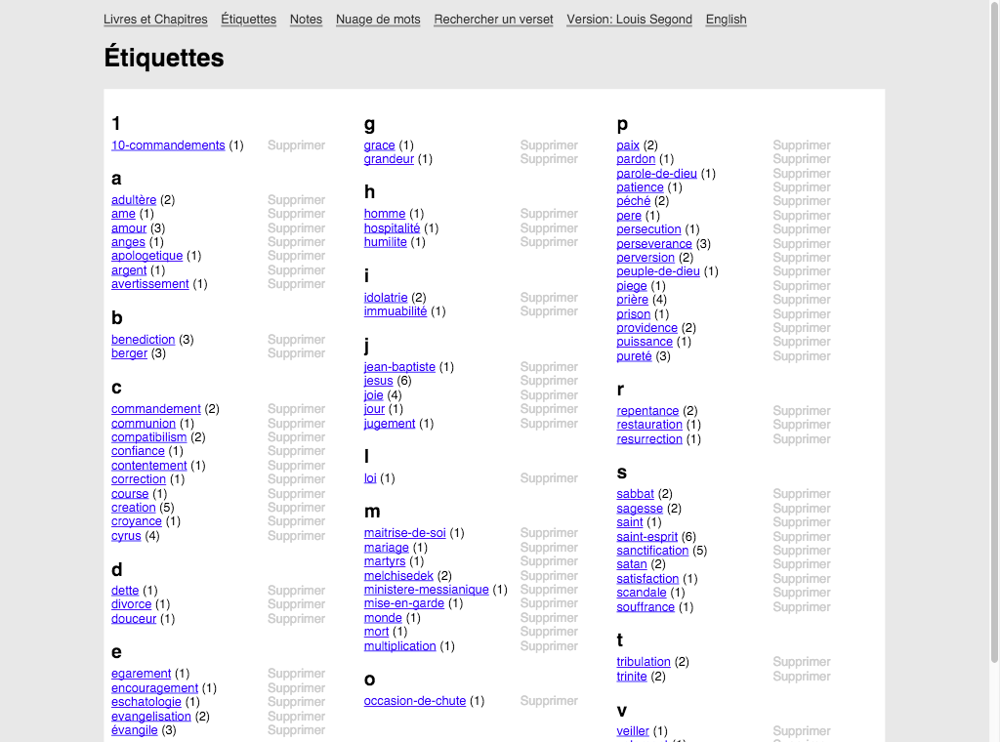
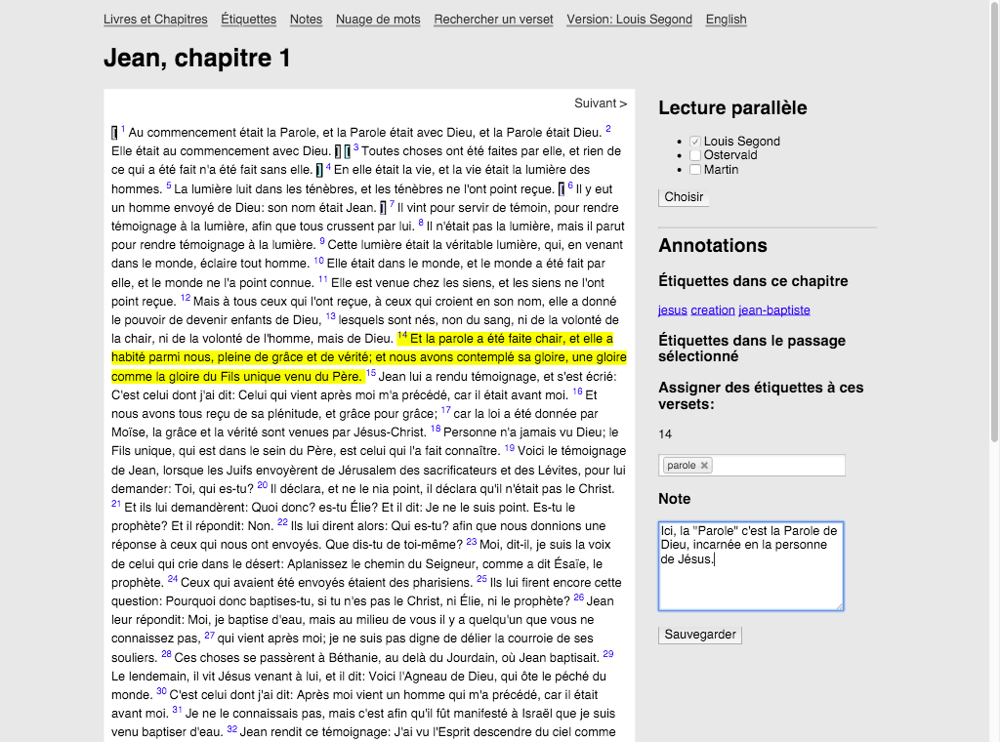
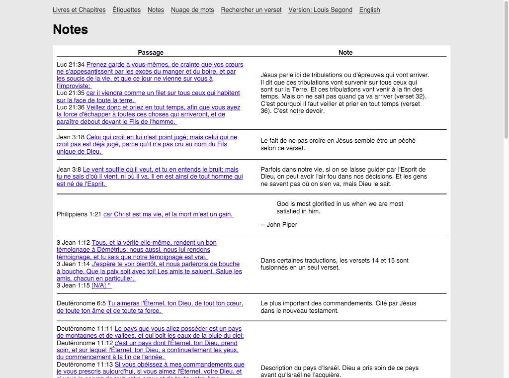
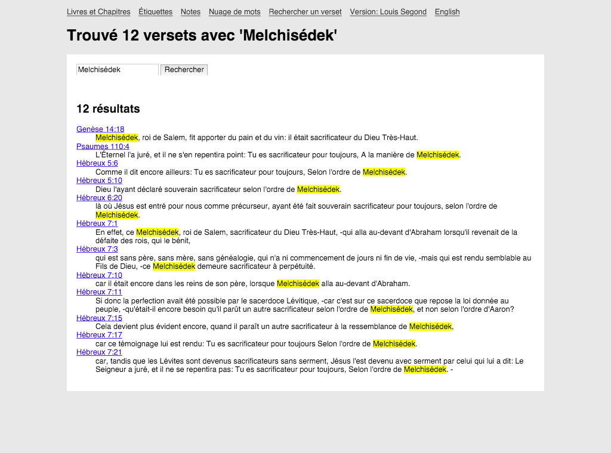
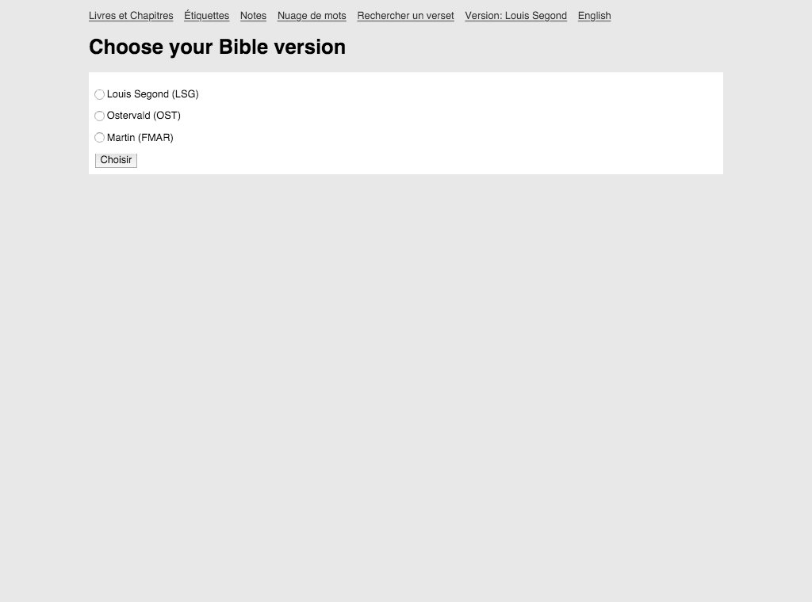

# Data Bible

*Data Bible* est une application Web d'étude biblique dont le code source est libre.

## Fonctionnalités

* Outil de recherche de versets, avec opérateurs booléens (&& et ||)
* Étiquettage (tagging) de passages (groupes de versets) pour une catégorisation flexible
* Ajout de notes personnelles aux passages sélectionnés
* Nuage de mots, pour voir quels sont les mots les plus utilisés dans chaque
  livre de la Bible
* Traductions **Louis Segond (1910)**, **Martin (1744)** et **Osterval (1996)** incluses
* Lecture parallèle (côte à côte) de plusieurs traductions de la Bible en même temps

### Captures d'écran

#### Mode de lecture de plusieurs traductions en parallèle

#### Nuage de mots populaires pour chaque livre

#### Étiquetter des passages de la Bible

#### Ajout de notes à des passages

#### Outil de recherche de versets

#### Plusieurs traductions françaises disponibles

### Fonctionnalités futures

* Page qui liste les livres et chapitres par auteur présumé
* Page qui liste les livres et chapitres par époque présumée de rédaction (ordre chronologique)
* Ajouter l'index de concordances de [Strong](https://en.wikipedia.org/wiki/Strong%27s_Concordance) sur les mots qui s'appliquent. Au moins pour la traduction Louis Segond qui est actuellement disponible.
* Outil de recherche plus avancé, entre autre pour:
  * exclure certains mots des résultats de recherche

## Configuration requise

* Système d'exploitation Mac OS X ou Linux
* Ruby >= 1.9.3

## Installation

1. `git clone https://github.com/juliend2/data-bible.git`
2. `cd data-bible`
3. `bundle install`
4. `rake db:migrate`
5. `env JSON_PATH=./db/seed_data/louis-segond-formatted.json VERSION_SLUG=LSG rake db:seed`

## Lancer l'application

1. `rails server`
2. Ouvrir [http://localhost:3000/](http://localhost:3000/) dans votre
   navigateur.

## License

[GPLv3](http://www.gnu.org/licenses/gpl-3.0.fr.html)
